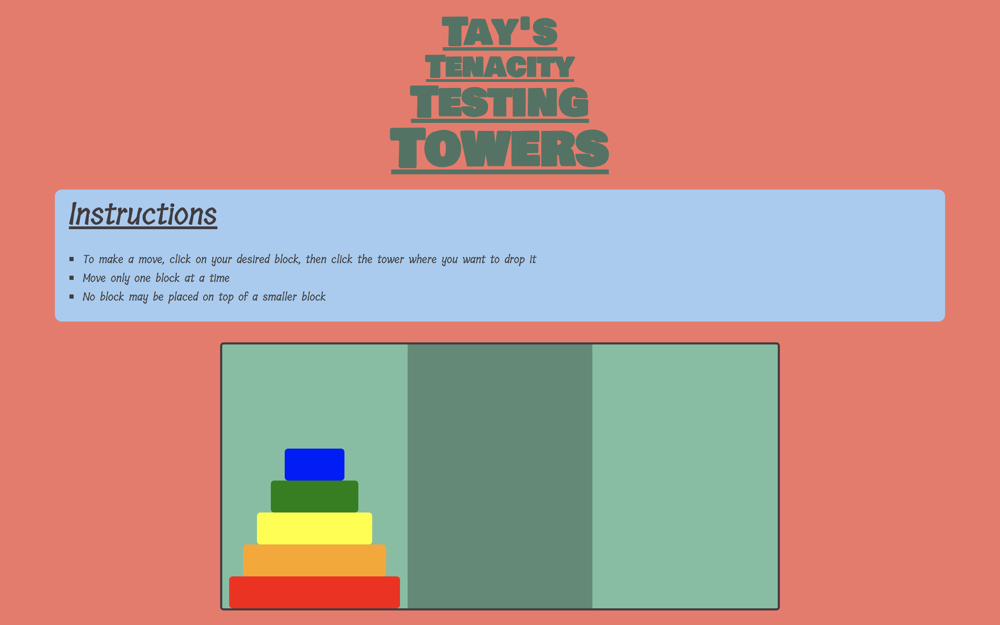

# Tay-Tower-Game
A webpage for playing the Tower of Hanoi Game. Doubles as a page to show off skills as a front-end dev to potential employers. Triples as a fun puzzle to annoy friends with. 

## Current Features
- Users can move blocks from one tower to another by clicking to select boxes and towers.
- Game logic prevents users from making illegal moves.
- Users can view the underlying JS using the link in the footer.
- Users can connect with the developer on social media using the social media links.

## Technologies Used
- Javascript
- HTML
- CSS

## Installation Instructions
No installation necessary. Play in browser. 

## Contribute
- Source code: https://github.com/Tkaldahl/Tay-Tower-Game
- Issue Tracker: https://github.com/Tkaldahl/Tay-Tower-Game/issues